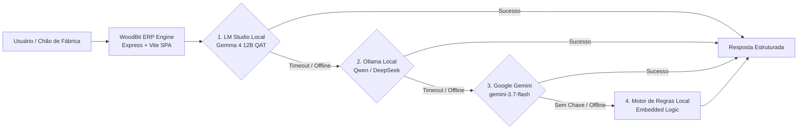

# 🪵 WoodBit ERP — Organic Tech
### ERP Inteligente para Marcenaria 4.0 & Fabricação Digital (CNC Router + Impressão 3D FDM)
> **Arquitetura Local-First com IA Privada de Alto Desempenho (Google Gemma 4 12B QAT via LM Studio)**

---

[](https://react.dev/)
[](https://www.typescriptlang.org/)
[](https://tailwindcss.com/)
[](https://lmstudio.ai/)
[](https://lmstudio.ai/)
[](https://nodejs.org/)
[](#)

---

## 📖 Visão Geral do Produto

O **WoodBit ERP** é a solução definitiva de gestão operacional, PCP e engenharia de custos desenvolvida sob medida para oficinas que integram **Marcenaria Tradicional de Alto Padrão** e **Manufatura Digital (Router CNC e Impressoras 3D FDM)**.

Projetado estrategicamente para a realidade de marcenarias modernas e focado na região de **Natividade e Noroeste Fluminense / RJ** (atendendo também Itaperuna, Porciúncula e Varre-Sai), o WoodBit elimina o desperdício de matéria-prima, blinda a oficina contra erros de medição na casa do cliente e calcula a margem real de cada projeto centavo por centavo.

---

## ⚡ Diferenciais Competitivos ("Por que o WoodBit?")

- 🔒 **Privacidade Absoluta (Zero Cloud Leak)**: Fotos de quartos, cozinhas residenciais e dados de clientes são processados **100% offline na GPU da oficina**, sem envio para servidores de terceiros.
- 💰 **R$ 0,00 por Token**: Motor de IA local com **Gemma 4 12B QAT** no LM Studio com visão computacional, raciocínio analítico e geração estruturada de JSON sem custos de API.
- 📐 **Visão Computacional na Medição de Campo**: Análise fotográfica de ambientes com detecção prévia de interferências (canos, tomadas, desníveis de piso e colunas fora de prumo) com carimbo jurídico obrigatório de resguardo.
- 🎙️ **Dite seu Orçamento por Voz (*Voice-to-Quote*)**: O marceneiro dita o projeto na bancada ou no cliente e a IA gera automaticamente a lista de corte de chapas, ferragens, horas de CNC e gramas de filamento 3D.
- 🧩 **PCP Multi-Centro Integrado**: Controle sincronizado de chão de fábrica dividindo as Ordens de Produção (OPs) entre Marcenaria, Router CNC, Fazenda 3D, Montagem, Acabamento e Instalação Externa.
- 📊 **Otimizador de Corte 2D com Orientação de Veio**: Reduz o desperdício de chapas de MDF (Louro Freijó, Branco TX, Grafite) calculando a sangria da serra (*kerf*) e aproveitando retalhos.

---

## 🏗️ Arquitetura de Software & IA Híbrida

O WoodBit opera com um pipeline de resiliência em **4 camadas de tolerância a falhas**:



---

## 🗂️ Módulos da Plataforma

| Ícone | Módulo | Descrição Funcional |
| :---: | :--- | :--- |
| 📊 | **Dashboard Executivo** | Indicadores de faturamento, OPs ativas, ocupação de máquinas, leads no funil e alternância de temas (Dark Titanium / Light Natural Wood). |
| 💬 | **CRM & Funil WhatsApp** | Kanban de vendas com **Triagem Inteligente** (urgência, complexidade, se exige visita técnica e perguntas pré-formatadas). |
| 🏭 | **PCP Multi-Centro** | Chão de fábrica com telemetria de Router CNC, Impressoras 3D, Coladeiras de Borda e Seccionadoras com histórico de manutenção. |
| 📐 | **Otimizador de Corte 2D** | Plano de corte interativo com cálculo de perda percentual, espessura de lâmina (*kerf*) e respeito aos veios do MDF amadeirado. |
| 💵 | **Orçamentos & Custos** | Engenharia paramétrica de custos com alerta de margem de sobrevivência (< 25%) e suporte a ditar orçamentos por voz. |
| 🗄️ | **Projetos & Ambientes** | Versionamento de projetos, checklist de cômodos, cálculo de risco e fotos técnicas. |
| 🕹️ | **Configurador Gamer & Decor** | Catálogo paramétrico de mesas gamer, nichos acústicos e suportes com disparo de OP direto para o chão de fábrica. |
| 📦 | **Estoque & Materiais** | Controle de chapas MDF (6mm a 25mm), filamentos 3D (PLA/PETG/ABS/TPU) e ferragens com alerta de estoque crítico. |
| 💳 | **Gestão Financeira** | Contas a pagar/receber vinculadas aos centros de custo (Marcenaria, CNC, Impressão 3D e Geral). |
| 📏 | **Medição de Campo** | Checklist minucioso para visita técnica (prumo, esquadro, pontos de água/esgoto/gás, abertura de portas) e fotos. |
| 🌐 | **Portal do Cliente** | Interface de transparência para o cliente acompanhar o progresso fotográfico da fabricação do seu móvel em tempo real. |
| 🧠 | **Laboratório de IA** | Descoberta automática de modelos locais, benchmarks de velocidade e latência e testes de visão computacional. |
| 🛡️ | **Auditoria & LGPD** | Trilha imutável de eventos com controle de acesso por papéis (*RBAC*). |

---

## 🚀 Como Executar Localmente

### Pré-requisitos
- **Node.js** v20 ou superior (recomendado Node v24+)
- **NPM** v10+
- **LM Studio** instalado com o modelo `google/gemma-4-12b-qat` carregado na memória GPU.

### 1. Clonar o Repositório e Instalar Dependências
```bash
git clone https://github.com/Adriano-Lengruber/WoodBit.git
cd WoodBit
npm install
```

### 2. Configurar o Ambiente Local
Crie o arquivo `.env` a partir do modelo:
```bash
cp .env.example .env
```
O arquivo `.env` já vem pré-parametrizado para execução local:
```env
PORT=3000
GEMINI_API_KEY= # Opcional: apenas se desejar fallback em nuvem
OLLAMA_BASE_URL=http://localhost:11434
LM_STUDIO_BASE_URL=http://localhost:1234
```

### 3. Iniciar o Servidor de Desenvolvimento
```bash
npm run dev
```

Abra no seu navegador: 👉 **[http://localhost:3000](http://localhost:3000)**

---

## 🤖 Guia Rápido da IA Local (LM Studio + Gemma 4 12B QAT)

1. Abra o **LM Studio** e baixe o modelo: `google/gemma-4-12b-qat`.
2. Na aba de servidor local (`<->`), selecione o modelo e ligue o servidor na porta padrão: `http://localhost:1234`.
3. Ajuste o **GPU Offload** para `Max` e o **Context Length** para `8192` (ou `16384`).
4. Abra o WoodBit ERP na aba **IA & Operações**: o status exibirá **Online** automaticamente.

---

## 📚 Documentação Adicional

Acesse a suíte completa de documentação na pasta [`docs/`](docs/):
- 🎯 [**`docs/PRODUCT_OVERVIEW.md`**](docs/PRODUCT_OVERVIEW.md) — Apresentação Comercial, ROI e Proposta de Valor.
- 🏛️ [**`docs/ARCHITECTURE.md`**](docs/ARCHITECTURE.md) — Arquitetura Técnica, Decisões de Engenharia e LGPD.
- 🛠️ [**`docs/LOCAL_AI_SETUP.md`**](docs/LOCAL_AI_SETUP.md) — Manual Técnico de Parametrização do LM Studio.

---

## 📄 Licença
Propriedade de WoodBit Organic Tech — Todos os direitos reservados.
Desenvolvido com foco na indústria de marcenaria e fabricação digital regional e global.
