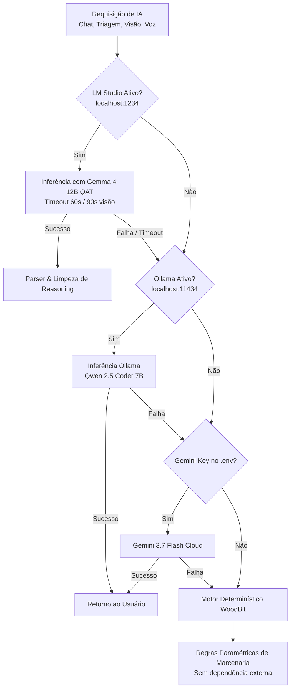

# WoodBit ERP — Arquitetura de Software & Engenharia de IA

Este documento descreve a arquitetura técnica, decisões de engenharia (*Architectural Decision Records - ADRs*), padrões de comunicação e segurança do **WoodBit ERP**.

---

## 1. Visão Geral da Arquitetura

O WoodBit ERP adota uma arquitetura **Fullstack TypeScript Híbrida e Local-First**, projetada para operar em estações de trabalho de chão de fábrica, notebooks de visita técnica e servidores locais de oficina.

```
+-----------------------------------------------------------------------------------+
|                              Cliente Frontend (SPA)                               |
|  React 19 + Tailwind CSS 4 + Lucide Icons + Motion + Context API + LocalStorage   |
+-----------------------------------------------------------------------------------+
                                         │
                        HTTP / REST APIs (JSON Payload)
                                         ▼
+-----------------------------------------------------------------------------------+
|                        WoodBit Backend Engine (Node / Express)                    |
|                server.ts (Porta 3000) + Vite Middleware Dev Server                 |
+-----------------------------------------------------------------------------------+
     │                           │                            │                    │
     ▼                           ▼                            ▼                    ▼
[LM Studio Gateway]      [Ollama Local API]           [Gemini Cloud API]     [Rule Engine]
localhost:1234/v1        localhost:11434/api          Google GenAI SDK       Embedded Logic
(Gemma 4 12B QAT)        (Qwen / DeepSeek)            gemini-3.7-flash       (Zero Fallback)
```

---

## 2. Pipeline de Inferência de Inteligência Artificial Local-First

A grande inovação arquitetural do WoodBit é o seu **Pipeline de Resiliência em 4 Camadas**:



### 2.1. Descoberta Dinâmica de Modelos (`GET /api/ai/models`)
O backend interroga as APIs de descoberta de modelos locais no carregamento:
- LM Studio: `GET http://localhost:1234/v1/models`
- Ollama: `GET http://localhost:11434/api/tags`
- Gemini: Checagem da variável `process.env.GEMINI_API_KEY`

O seletor inteligente prioriza explicitamente modelos quantizados eficientes:
```ts
async function getLMStudioActiveModel(): Promise<string> {
  const models = await getLMStudioModels();
  if (!models || models.length === 0) return 'google/gemma-4-12b-qat';
  const gemmaQat = models.find(
    (m) => m.toLowerCase().includes('gemma-4-12b-qat') || m.toLowerCase().includes('google/gemma-4-12b-qat')
  );
  if (gemmaQat) return gemmaQat;
  const anyGemma4 = models.find((m) => m.toLowerCase().includes('gemma-4-12b'));
  if (anyGemma4) return anyGemma4;
  return models[0];
}
```

### 2.2. Tratamento de Reasoning & Tokens de Pensamento
Modelos como o **Gemma 4 12B** geram cadeias de raciocínio (*Chain-of-Thought*) antes da resposta final.
- O LM Studio envia o raciocínio em `choices[0].message.reasoning_content` e a resposta em `choices[0].message.content`.
- O backend garante `max_tokens: 2048` para evitar que a cota de tokens seja consumida apenas pelo raciocínio preliminar.
- O helper `extractJsonFromText` emprega expressões regulares com tolerância a blocos markdown (````json ... ````) e pré-textos para garantir retorno de JSON estrito.

---

## 3. Segurança, Privacidade e LGPD

1. **Privacidade de Imagens e Dados Pessoais**:
   - Em marcenarias sob medida de alto padrão, clientes residenciais são extremamente sensíveis ao compartilhamento de fotos de seus quartos, banheiros e salas.
   - O uso do **Gemma 4 12B QAT local no LM Studio** garante que **nenhuma foto sai da rede interna da oficina**.
2. **Blindagem Jurídica de Medição**:
   - Todas as respostas geradas por IA no módulo de visão e medição inserem compulsoriamente a cláusula:
     > *"Estimativa visual — não substitui medição técnica."*
   - O marceneiro é orientado pelo sistema a validar fisicamente o checklist presencial (prumo, esquadro, pontos hidráulicos).
3. **Trilha de Auditoria (Audit Trail)**:
   - Toda alteração crítica (preço de venda, margem abaixo de 25%, criação de OP, validação de medição) gera um evento registrado com `actor`, `actorRole`, `timestamp` e `entityId`.

---

## 4. Estrutura de Diretórios do Projeto

```
WoodBit/
├── .agent/                    # Governança, workflows e skills do assistente Antigravity
├── docs/                      # Documentação técnica e comercial de alto padrão
│   ├── PRODUCT_OVERVIEW.md    # Visão executiva, proposta de valor e venda do produto
│   ├── ARCHITECTURE.md        # Arquitetura de software e decisões de engenharia
│   └── LOCAL_AI_SETUP.md      # Manual de configuração do LM Studio + Gemma 4
├── src/
│   ├── components/
│   │   ├── ai/                # Gateway e lab interativo de IA (chat + visão)
│   │   ├── audit/             # Trilha de auditoria e conformidade
│   │   ├── catalog/           # Configurador de móveis gamer e decor
│   │   ├── crm/               # Kanban de leads e triagem inteligente
│   │   ├── dashboard/         # KPIs de faturamento, OPs e máquinas
│   │   ├── field/             # Checklist técnico de medição externa
│   │   ├── finance/           # Contas a pagar/receber por centro de custo
│   │   ├── inventory/         # Estoque de chapas MDF, filamentos e ferragens
│   │   ├── layout/            # Header, Sidebar e navegação por papel (RBAC)
│   │   ├── portal/            # Portal de acompanhamento para o cliente final
│   │   ├── production/        # PCP chão de fábrica e otimizador de corte 2D
│   │   └── projects/          # Gerenciador de projetos e cômodos
│   ├── context/               # Notificações Toast e estados globais
│   ├── data/                  # MockDatabase e schemas de inicialização
│   ├── services/              # Persistência segura em localStorage
│   ├── types/                 # Definições estritas TypeScript de todo o domínio
│   ├── App.tsx                # Roteador central e controle de estado
│   └── index.css              # Sistema de design orgânico WoodBit (Tailwind 4)
├── server.ts                  # Servidor Express com Gateway de IA e integração Vite
├── package.json               # Dependências do ecossistema React 19 + Express
├── tsconfig.json              # Configurações do compilador TypeScript
└── vite.config.ts             # Configuração de build e plugins Tailwind/React
```

---

## 5. Roadmap de Evolução Técnica

1. **Camada de Persistência no Servidor**:
   - Integrar **SQLite embutido** (`better-sqlite3` ou Prisma) para persistir OPs, estoque e projetos no disco do servidor, permitindo acesso simultâneo de múltiplos computadores e tablets na oficina.
2. **Visualizador 3D para CAM / Impressão 3D**:
   - Componente Three.js / Canvas para renderização e inspeção de arquivos `.stl`, `.3mf` e visualização de trajetórias G-Code de corte da Router CNC.
3. **PWA & Modo Offline de Campo**:
   - Transformar o módulo de Medição de Campo em Progressive Web App (PWA) para marceneiros coletarem fotos e preencherem checklists mesmo sem sinal de celular no cliente.
