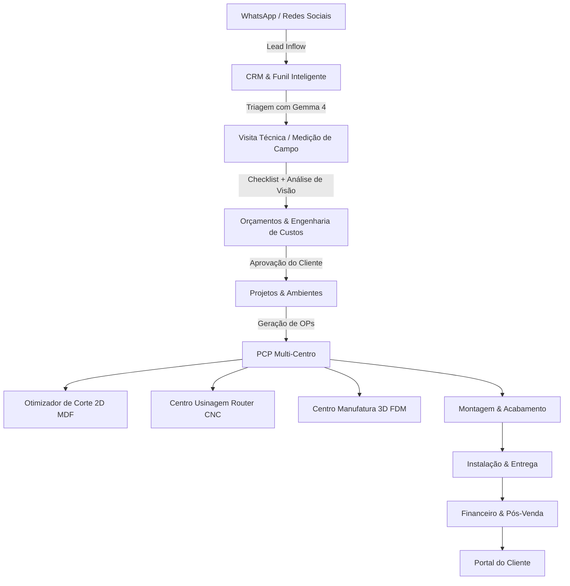

# WoodBit ERP — Organic Tech
## Plataforma Integrada de Gestão Inteligente para Marcenaria Sob Medida e Fabricação Digital (CNC + Impressão 3D)

---

### 1. Visão Executiva & Proposta de Valor ("Vender o Peixe")

O **WoodBit ERP** é a primeira plataforma de gestão operacional e financeira concebida nativamente para a **convergência entre a marcenaria tradicional de alto padrão e a manufatura aditiva/subtrativa digital (CNC Router e Impressão 3D FDM)**.

Tradicionalmente, marcenarias enfrentam quatro grandes gargalos crônicos:
1. **Orçamentos lentos ou com margens mal calculadas**: Erros comuns na precificação de horas de máquina, perdas de chapa e consumo de ferragens que corroem o lucro.
2. **Falhas críticas na medição de campo**: Desníveis, paredes fora de prumo ou interferências com canos/tomadas descobertos apenas no momento da montagem na casa do cliente.
3. **Falta de controle de chão de fábrica (PCP)**: Desalinhamento entre o que foi desenhado, o que foi usinado na CNC, o que foi impresso em 3D e o que está aguardando montagem.
4. **Dependência ou custo excessivo de nuvem**: Ferramentas pesadas de mercado exigem conexões de internet constantes e caras, muitas vezes inviáveis em galpões industriais ou em visitas externas no interior.

O **WoodBit ERP resolve esses desafios através de uma abordagem Local-First potencializada por Inteligência Artificial**:
- **Zero Custo por Token**: Inferência local de ponta a ponta na própria oficina com **Google Gemma 4 12B QAT** rodando no LM Studio.
- **Privacidade Absoluta**: Fotos da casa do cliente e dados confidenciais de contratos nunca saem da máquina local.
- **Engenharia de Custos Real**: Margem calculada centavo a centavo (MDF, fita de borda, desgaste de fresas CNC, gramas de filamento PETG/PLA, horas de máquina e tributos).
- **Foco Regional Estratégico**: Parametrizado para a realidade do **Noroeste Fluminense/RJ** (Natividade, Itaperuna, Porciúncula, Varre-Sai), considerando clima úmido (MDF Ultra), logística local e perfis de clientes da região.

---

### 2. Mapa dos Módulos do Sistema

---

### 3. Detalhamento Funcional por Módulo

#### 3.1. CRM & Funil de Atendimento com Triagem por IA
- **Entrada Omnichannel**: Captação de leads via WhatsApp, Instagram e balcão.
- **Triagem Preditiva com Gemma 4 12B**: O modelo analisa o briefing informal do cliente e devolve instantaneamente:
  - Categoria (`Planejados`, `Linha Gamer`, `Fabricação Digital`).
  - Nível de urgência e complexidade técnica estimada.
  - Veredito claro: *Se exige ou não visita técnica presencial para medição de prumo/esquadro*.
  - Lista de informações faltantes (ex: ponto de gás, modelo do cooktop, voltagem 110v/220v).
  - Sugestão de perguntas prontas para o vendedor enviar no WhatsApp com 1 clique.

#### 3.2. Visita Técnica & Medição de Campo com Visão Computacional
- **Checklist Técnico Rígido**: Prumo de paredes, nivelamento de piso, pé-direito, abertura de janelas e portas, mapeamento de tomadas, hidráulica e gás.
- **Análise Fotográfica de Ambientes (Gemma 4 Vision)**: O marceneiro fotografa o cômodo e o modelo local detecta obstáculos embutidos, sugere passagem de cabos e alerta sobre prumo irregular.
- **Blindagem Jurídica Obrigatória**: Toda análise gerada por imagem carrega o carimbo auditável: *"Estimativa visual — não substitui medição técnica"*, resguardando a oficina.

#### 3.3. Orçamentação Paramétrica & Dito por Voz (*Voice-to-Quote*)
- **Dite seu Orçamento na Oficina**: O marceneiro pode gravar um áudio descrevendo o móvel ("*Armário de 2,80m em Louro Freijó com 3 gavetas com amortecedor e painel ripado usinado na CNC*"). O Gemma 4 transcreve e estrutura o orçamento em itens de insumo, horas de máquina e mão de obra.
- **Alerta de Margem Mínima de Sobrevivência**: Alerta vermelho caso a margem operacional caia abaixo de 25%, evitando fechar serviços com prejuízo invisível.
- **Composição Híbrida de Custos**:
  - MDF (chapa inteira ou m² ponderado).
  - Usinagem CNC (tempo de fuso/corte + desgaste de ferramenta).
  - Impressão 3D (peso em gramas de filamento + tempo de bico).
  - Ferragens e amortecedores (Blum, Hettich, Hafele, Slow).

#### 3.4. PCP Multi-Centro (Chão de Fábrica Inteligente)
- Separação clara de centros produtivos:
  1. **Marcenaria Tradicional**: Seccionamento, colagem de borda hotmelt, furação e montagem de caixas.
  2. **Router CNC Digital**: Cortes curvos, painéis ripados, rebaixos e canais de fita de LED.
  3. **Manufatura 3D**: Suportes de fone, passa-cabos customizados, puxadores ergonômicos e gabaritos de montagem.
  4. **Acabamento e Laca**: Pintura, verniz e controle de poeira.
  5. **Instalação Externa**: Logística de transporte e fixação final.
- Telemetria de máquinas em tempo real: status (disponível, operando, manutenção preventiva, bloqueada), taxa de ocupação percentual e histórico de manutenção.

#### 3.5. Otimizador de Corte 2D Integrado
- Cálculo de sangria de serra (*kerf* de 3mm a 4mm).
- Respeito à orientação de veio da madeira (MDF amadeirado tipo Freijó ou Carvalho não pode ter veios invertidos).
- Indicador visual do aproveitamento percentual da chapa (meta > 85%) e identificação de retalhos úteis para o estoque.

#### 3.6. Configurador de Produtos (Linha Gamer & Decor)
- Catálogo de mesas gamer de alta performance, nichos acústicos e suportes ergonômicos.
- Parametrização direta: ao escolher acabamento, iluminação LED e rebaixo CNC, o sistema dispara a **Ordem de Produção (OP)** diretamente para as máquinas da oficina, sem refações de desenho.

#### 3.7. Estoque & Gestão de Matéria-Prima
- Controle unitário de chapas de MDF (com especificações de espessura de 6mm, 15mm, 18mm, 25mm e acabamentos Branco TX, Grafite, Louro Freijó).
- Controle de carretéis de filamento 3D por tipo de polímero (PLA, PETG, ABS, TPU) e cor.
- Alertas preditivos de reposição antes do esgotamento da chapa para a próxima OP agendada.

#### 3.8. Portal do Cliente
- Interface moderna para o consumidor final acompanhar o nascimento do seu móvel: fotos da usinagem na CNC, peças impressas em 3D, montagem na bancada e data agendada de instalação.
- Transparência que reduz em 80% a ansiedade e as ligações diárias de cobrança de prazo.

#### 3.9. Trilha de Auditoria & Segurança
- Registro detalhado e imutável de todas as ações de usuários (criação de projetos, aprovação de orçamentos, alteração de margens, disparos de máquina).
- Controle baseado em papéis (*RBAC*): Diretor Geral, Vendedor Técnico, Marceneiro Chefe, Operador CNC e Instalador.

---

### 4. Por que Escolher o WoodBit ERP? (Resumo Comercial)

| Benefício | Marcenaria sem WoodBit | Marcenaria com WoodBit ERP |
| :--- | :--- | :--- |
| **Tempo para Emitir Orçamento** | 2 a 4 dias úteis | 15 a 30 minutos (ou segundos via voz) |
| **Erros de Medição na Instalação** | 15% a 25% dos projetos | < 2% (Checklist + IA de Visão) |
| **Custo de IA / Software de Gestão** | Mensalidades caras em dólar | R$ 0,00 por chamada de IA local |
| **Aproveitamento de Chapa de MDF** | 65% a 72% | 85% a 92% (Otimizador 2D) |
| **Percepção de Valor pelo Cliente** | Oficina tradicional analógica | Indústria 4.0 boutique de tecnologia |
